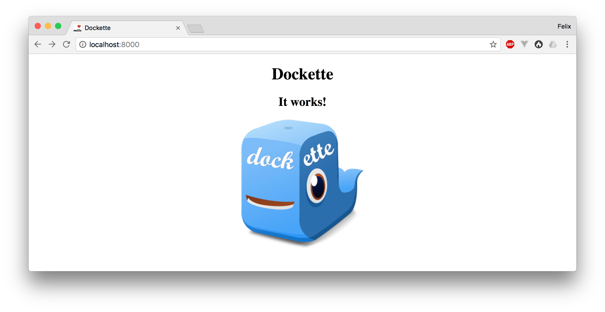
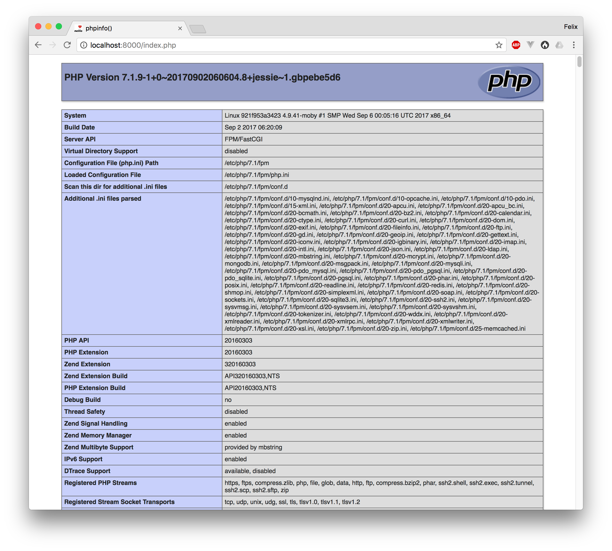

# Dockette/Web

Example of `phpinfo()` in `dockette/web`.

## Usage

- `docker-compose up`
- open `http://localhost:8000` in your browser
- open `http://localhost:9000` in your browser

## Screenshot

